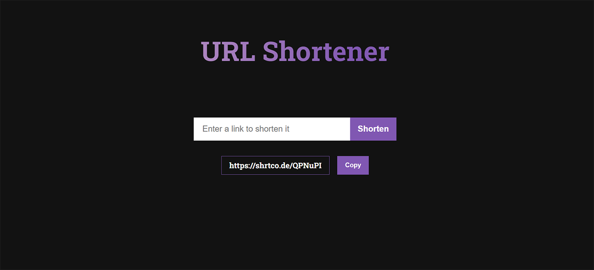

# LinkShortener, is a website that shortens longer URL's into shorter ones

## Takes a URL link input, and using shrtcode's API converts that URL into a shorter one which you can easily copy to clipboard

<p align="center">
    
</p>

- has an input form that passes the user URL to a component that runs it throught the API as an input
- the API retuns the shorter link, which is conditionally rendered on the screen
- a copy to clipboard button that lets you easily copy the shortened link

  ## Technologies Used

-   [](https://reactjs.org/)
-   [](https://developer.mozilla.org/en-US/docs/Web/CSS)
  - [](https://mui.com/)
  - [](https://axios-http.com/)

## Click on the image to watch a video demo of the website!


## How to get the project working on your device
-clone the repository
   ```sh
   git clone https://github.com/your_username_/Project-Name.git
   ```
- navigate to the project directory and install all dependencies
  ```sh
   npm install
   ```
- go to Developer API option at [shrtcode](https://shrtco.de/) to see the API code
- run the project
   ```sh
     npm start
     ```


